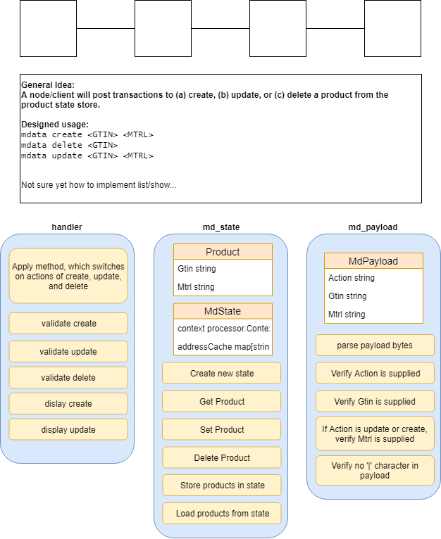

# Purpose
This repository is meant to stimulate ideas on how to store public data records on Hyperledger Sawtooth. 
It's a slightly modified copy of xo_go transaction processor, part of github.com/hyperledger/sawtooth-sdk-go

